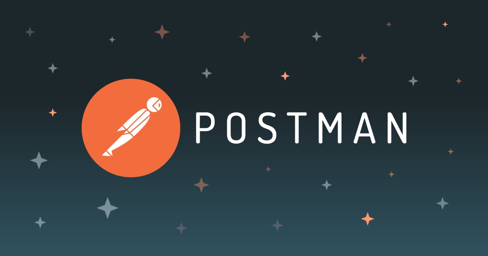

# Introducción

Durante el transcurso del curso se construira una aplicación completa vista desde la perspectiva de sus componentes, es decir, se va desarrollar un back-end con funcionalidad y base de datos, y también, se va generar una SPA (Single Page Application) para que el usuario pueda utilizar las funcionalidades provistas por el servidor.

Para este curso se divide la construcción en dos partes:

 **La primera** es la construcción de la API (Application Programming Interface) REST la cual se creará utilizando [.Net Core](https://dotnet.microsoft.com/learn/dotnet/hello-world-tutorial/install).

Cabe hacer énfasis que en esta parte no vamos a tener una GUI de usuario, sino que haremos el servicio y lo probaremos utilizando una aplicación para ello llamada [Postman](https://www.postman.com).

**La segunda** es la construcción de una [SPA](https://blog.angular-university.io/why-a-single-page-application-what-are-the-benefits-what-is-a-spa/) (aplicación web) con la que el usuario podrá utilizar el sistema. La misma se realizará en [Angular](https://angular.io).

# Stack de tecnologías a emplear
## Visual Studio Code

Editor [Visual Studio Code](https://code.visualstudio.com). Es un editor de texto que soporta todo lo que requerimos para el desarrollo del trabajo tanto en C# (Back-end) como para TypeScript (Front-end). Es posible agregarle algunas extensiones y completar su funcionalidad. 

Links interesantes:

 - [C# for Visual Studio](https://marketplace.visualstudio.com/items?itemName=ms-dotnettools.csharp) Extensión que facilita el desarrollo en C# con Visual Studio Code.
 - [TSLint](https://marketplace.visualstudio.com/items?itemName=ms-vscode.vscode-typescript-tslint-plugin) Extensión que facilita el desarrollo con TypeScript en Visual Studio Code.
 - [NuGet Gallery](https://marketplace.visualstudio.com/items?itemName=patcx.vscode-nuget-gallery) Extension para tener la galeria de librerias en VSC
 - [Live Share](https://marketplace.visualstudio.com/items?itemName=MS-vsliveshare.vsliveshare) Extension que sirve para mostrar y codificar de a pares
 - [C# Estensions](https://marketplace.visualstudio.com/items?itemName=jchannon.csharpextensions) Extension para crear archivos mas facil

 
Junto a estas extensiones Visual Studio Code se asemeja a un IDE completo, ya que tiene autocompletar, capacidades para debuggear, etc. Si conocen de mas extensiones que les puede facilitar y/o ayudar con el obligatorio pueden utilizarlas.

## Base de datos
En el curso vamos usar el motor de base de datos [SQL Server](https://www.microsoft.com/es-mx/sql-server/sql-server-downloads?rtc=1). Para los que usen MAC segurmaente van a tener que instalar y trabajar con [Docker](https://www.docker.com/get-started)(Les dejamos una [guia](https://cheerful-nation-1ca.notion.site/Instalaci-n-SQL-server-MacOS-c8e0aedbf5c64729a0f1e3f1eee71b0a) de instalacion y de uso).

## Postman
Utilizaremos [Postman](https://www.postman.com/) (version 7.18 o superior) para probar la API que se hara. Postman es una plataforma para probar el desarrollo de API. Las diferentes secciones de Postman permiten simplificar cada paso de comunicacion con una API para que la creacion de la misma sea mas rapida.

## Framework
Para lo que es la codificación del **backend** vamos a usar la última versión de [.Net Core](https://dotnet.microsoft.com) (version 5.0).

Para lo que es la codificación del **frontend** vamos a usar  [Angular](https://angular.io).

Para que nos funcione Angular es necesario tener [Node](https://nodejs.org/es/download/) (version 14.17.5 LTS)

## Gestión del código
Es imprescindible tener GIT instalado en el equipo ya que es el repositorio que vamos a utilizar.

-Se consigue acá: [GIT](https://git-scm.com) y se puede usar línea de comandos o aplicación con GUI. **En la que mejor trabajemos**.

# Conceptos que se necesitan desde el día 0

A nivel teórico y tecnológico todo lo que se dio en Diseño de Aplicaciones 1 se entiende como ya "dado" en este curso y por ello, los aspectos centrales deben estar claros: 
	

- Buenas prácticas de codificación y diseño, a modo de ejemplo Clean Code, principios SOLID y los GRASP, codificación con TDD y Refactoring.
- UML 
- Como se codifica en C#
-  Se necesita tener claro el concepto de ORM y lo visto para Entity Framework. En particular vamos a usar [EF Core](https://www.entityframeworktutorial.net/efcore/entity-framework-core.aspx), si no se acuerdan o no conocen, pueden ir probando. Igual a lo largo del semestre vamos a ir introduciendolo
- Conocimientos adquiridos en asignaturas de Ingeniería de Software tales como elaborar documentación, tener una organización mínima en el proyecto, etc.
- Buen manejo de Git. El manejo de git y de gitflow es importante durante el curso. Como se utilizara Github, sera necesario aprender como funciona la herramienta. Para repasarlo   [Pro GIT](https://bibliotecas.ort.edu.uy/bibid/80216) (Libro muy completo sobre la funcionalidad de Git. Se encuentra en biblioteca).
